# Almacenes

Los almacenes de un negocio forman parte de las [áreas](../glosario.md#areas) que se gestionan en Tecopos.

Similar a cómo funciona un almacén físico con productos y personas encargadas de llevar un inventario, la API de Tecopos realiza los mismos flujos:

</br>

> <mark>Nota importante:</mark>
> 
> Para completar cada uno de estos flujos , el cliente de las API de Tecopos debe estar primeramente [autenticado](autenticación.md) a través de un [usuario](usuarios.md) que le permita realizar dicha operación

</br>

### Gestión de Almacenes

>Limitado a usuarios de rol [Administrador](../glosario.md#roles)

</br>

- Creación de un almacén
- Modificación de propiedades y usos de un almacén
- Información sobre un almacén

</br>

#### Creación de un almacén

Un almacén no es más que la creación de un área especificando que sea de tipo [almacén](../glosario.md#areas) y proveyendo un nombre para este como identificador de cara a los usuarios.

<div style="text-align: right"><sup>Endpoint POST <a href="#nuevo-almacen">/administration/area</a></sup></div>


</br>

<sup>1</sup>: consultar los posibles [errores](../errores.md) manejados por la API 

</br>
</br>

#### Modificación de propiedades y usos de un almacén

De manera general se pueden modificar los atributos que son generados por parte del usuario. Los que más interesan son el nombre, el estado, y además regular el uso de movimientos directos así como el hacer despachos a partir de órdenes de producción.

<div style="text-align: right"><sup>Endpoint PATCH <a href="#nuevo-almacen">/administration/area/*idArea*</a></sup></div>

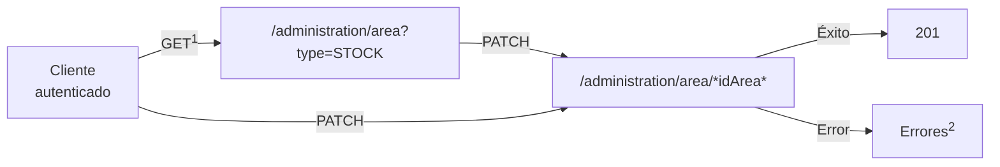
</br>

<sup>1</sup>: en caso de que no tenga el identificador del almacén desde antelación </br>
<sup>2</sup>: consultar los posibles [errores](../errores.md) manejados por la API 

</br>
</br>

#### Información sobre un almacén

De un almacén además de su nombre y estado se pueden obtener demás tipos de informaciones como una descripción, un código de referencia, si constituye un almacén principal, y otras características comunes que poseen las áreas.

<div style="text-align: right"><sup>Endpoint GET <a href="#nuevo-almacen">/administration/area/*idArea*</a></sup></div>

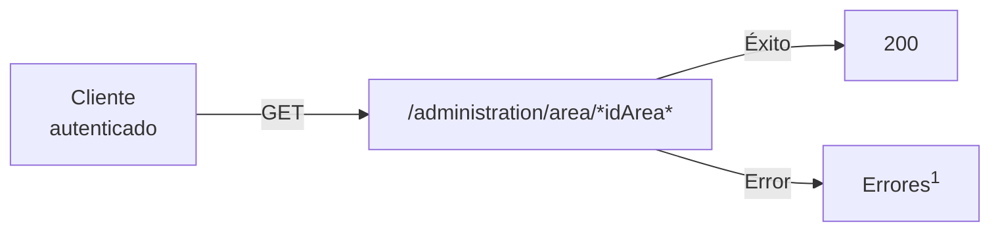
</br>

<sup>1</sup>: consultar los posibles [errores](../errores.md) manejados por la API 

</br>
</br>
</br>

---

### Gestión de Productos

>Limitado a usuarios de rol [Control](../glosario.md#roles) o superior.

</br>

- Entrada de productos
- Traslado de un producto hacia otra área
- Baja de un producto
- Ajuste de la cantidad de un producto
- Conversión de un producto en otro
- Disminución de un producto por desperdicio

</br>

#### Entrada de productos

Después de haberse definidos productos en el sistema, se puede realizar su entrada o en otras palabras el registro de estos luego de realizada una compra.

Para realizar una entrada de productos debe seleccionarse el almacén destino y los productos adquiridos, según el precio y proveedor si son necesarios especificarse. Como parte del proceso puede añadirse una nota y la cuenta bancaria empleada para dicha operación.

<div style="text-align: right"><sup>Endpoint POST <a href="#entrada-productos">/administration/movement/bulk/entry</a></sup></div>

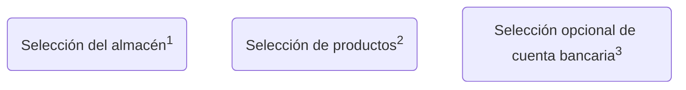


</br>
<sup>1</sup>: endpoint de obtención de almacenes </br>
<sup>2</sup>: endpoint de obtención de productos </br>
<sup>3</sup>: endpoint de obtención de cuentas bancarias </br>
<sup>4</sup>: consultar los posibles [errores](../errores.md) manejados por la API 

</br>
</br>

#### Traslado de un producto hacia otra área

Los productos de un almacén pueden ser trasladados hacia otro almacén, ya sea un su totalidad o determinada cantidad.

El procedimiento de realizar un traslado es simple. Primeramente se debe seleccionar el almacén origen, y de este, el o los productos a trasladar.  Luego, especificar la cantidad y finalmente el almacén destino. Este proceso también admite el adjunto de una nota para enriquecer el histórico de dicha operación.

<div style="text-align: right"><sup>Endpoint POST <a href="#traslado-productos">/administration/movement/bulk/move</a></sup></div>

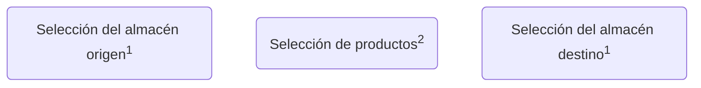


</br>
<sup>1</sup>: endpoint de obtención de almacenes </br>
<sup>2</sup>: endpoint de obtención de productos </br>
<sup>3</sup>: consultar los posibles [errores](../errores.md) manejados por la API 

</br>
</br>

#### Baja de un producto

De ser necesario necesario se le puede dar salida o baja a un producto. Para ello se especifica la cantidad del producto de determinado almacén para llevar a cabo su ejecución. El proceso admite adjunto de nota para reflejar las razones y/o conocimiento útil para dicha operación.

<div style="text-align: right"><sup>Endpoint POST <a href="#baja-productos">/administration/movement/bulk/out</a></sup></div>

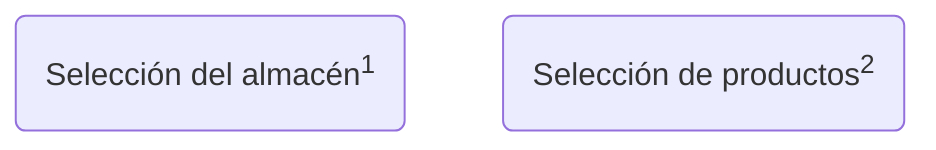
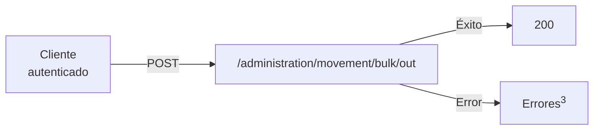
</br>
<sup>1</sup>: endpoint de obtención de almacenes </br>
<sup>2</sup>: endpoint de obtención de productos </br>
<sup>3</sup>: consultar los posibles [errores](../errores.md) manejados por la API 

</br>
</br>

#### Ajuste de la cantidad de un producto

Los errores por parte de una aplicación cliente pueden suceder, por tanto si se desea realizar un adjuste sobre la cantidad de un producto en el almacén, es posible.

En dependencia de si la nueva cantidad es especificada es mayor o menor, se considerará la operación como una entrada o salida del mismo correspondientemente.

<div style="text-align: right"><sup>Endpoint POST <a href="#baja-productos">/administration/movement/bulk/adjust</a></sup></div>


</br>
<sup>1</sup>: endpoint de obtención de almacenes </br>
<sup>2</sup>: endpoint de obtención de productos </br>
<sup>3</sup>: consultar los posibles [errores](../errores.md) manejados por la API 

</br>
</br>

#### Conversión de un producto en otro

El sistema de Tecopos es lo suficientemente versátil para utilizar un producto de materia prima, como por ejemplo, un saco de harina, y convertirlo en otros productos, como paquetes de harina de menor proporción.

<div style="text-align: right"><sup>Endpoint POST <a href="#baja-productos">/administration/movement/bulk/transformation</a></sup></div>

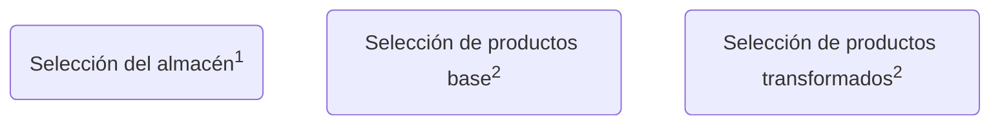
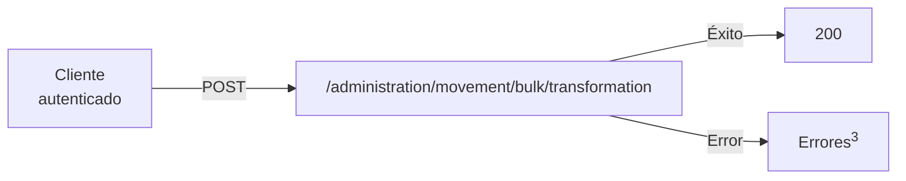
</br>
<sup>1</sup>: endpoint de obtención de almacenes </br>
<sup>2</sup>: endpoint de obtención de productos </br>
<sup>3</sup>: consultar los posibles [errores](../errores.md) manejados por la API 

</br>
</br>

#### Disminución de un producto por desperdicio

En caso de que un producto sufra daño o se desperdicie se puede registrar su merma.

<div style="text-align: right"><sup>Endpoint POST <a href="#baja-productos">/administration/movement/bulk/waste</a></sup></div>


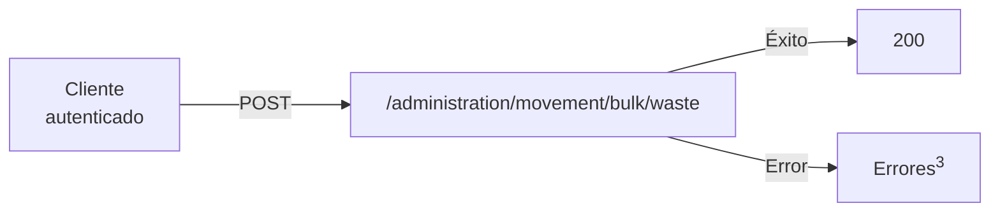

</br>
<sup>1</sup>: endpoint de obtención de almacenes </br>
<sup>2</sup>: endpoint de obtención de productos </br>
<sup>3</sup>: consultar los posibles [errores](../errores.md) manejados por la API 

</br>
</br>
#### Despachos de mercancías

A diferencia de un traslado físico, un despacho constituye un proceso más formal y detallado en planificación. La API de Tecopos ofrece de manera separada el control sobre este tipo de proceso. 

Similar a un traslado de productos, se debe especificar el almacén origen, de estos, los productos para conformar el despacho, y el almacén destino. Este proceso puede recibir una nota adjunta para enriquecer el histórico de la operación.

<div style="text-align: right"><sup>Endpoint POST <a href="#traslado-productos">/administration/dispatch</a></sup></div>

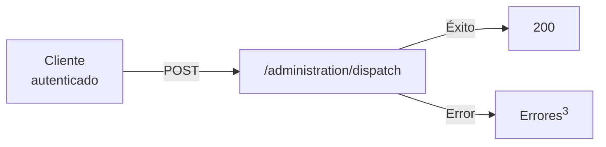
</br>
<sup>1</sup>: endpoint de obtención de almacenes </br>
<sup>2</sup>: endpoint de obtención de productos </br>
<sup>3</sup>: consultar los posibles [errores](../errores.md) manejados por la API 

</br>
</br>
</br>

---

### Control del Inventario y Reportes

>Limitado a usuarios de rol [Control](../glosario.md#roles) o superior.

</br>

- Obtención de operaciones
- Obtención del balance
- Obtención de la disponibilidad por producto
- Obtención de reportes dentro de un periodo determinado

</br>
#### Obtención de operaciones

Por cada almacén se puede obtener el historial de operaciones realizadas. De estas se pueden conocer detalles como los productos involucrados, la fecha de su ejecución, el usuario que la registró, entre otros.

Para facilitar la búsqueda entre operaciones se pueden emplear filtros como el tipo de operación, usuarios, rango de fechas, etc.

<div style="text-align: right"><sup>Endpoint GET <a href="#obtencion-balance">/administration/movement</a></sup></div>
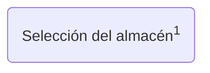
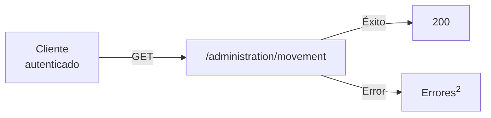
</br>
<sup>1</sup>: endpoint de obtención de almacenes </br>
<sup>2</sup>: consultar los posibles [errores](../errores.md) manejados por la API 

</br>
</br>
#### Obtención del balance

Para conocer la situación económica de un negocio, se puede consultar los balances de los almacenes. 

<div style="text-align: right"><sup>Endpoint GET <a href="#obtencion-balance">/report/stock/inventory</a></sup></div>


</br>

<sup>1</sup>: consultar los posibles [errores](../errores.md) manejados por la API 

</br>
</br>

#### Obtención de la disponibilidad por producto

El sistema Tecopos ayuda a conocer en tiempo real cual es la disponibilidad de los productos en cada almacén.

<div style="text-align: right"><sup>Endpoint GET <a href="#obtencion-disponibilidad">/report/stock/disponibility</a></sup></div>

```mermaid
flowchart LR
	A[Cliente
	autenticado] -- GET ---> B[ /report/stock/disponibility]
	B -- Éxito --> C[200]
	B -- Error --> D[Errores<sup>1</sup>]
```

</br>
</br>

#### Obtención de reportes dentro de un período determinado

Por cada almacén se puede obtener, un resumen de operaciones sobre cada producto dentro de un periodo de tiempo determinado. 

<div style="text-align: right"><sup>Endpoint GET <a href="#obtencion-reportes-rango">/stock/period-inventory</a></sup></div>

```mermaid
flowchart TD
   id1(Selección del almacén<sup>1</sup>)
```
```mermaid
flowchart LR
	A[Cliente
	autenticado] -- GET ---> B[ /stock/period-inventory]
	B -- Éxito --> C[200]
	B -- Error --> D[Errores<sup>2</sup>]
```
</br>
<sup>1</sup>: endpoint de obtención de almacenes </br>
<sup>2</sup>: consultar los posibles [errores](../errores.md) manejados por la API 

</br>
</br>
</br>

---

### Endpoints

#### Almacenes (Áreas)

[](https://god.gw.postman.com/run-collection/:collection_id)

| Descripción | Método HTTP | Dirección | Entrada de datos | Respuesta |
| ---- | ---- | ---- | ---- | ---- |
| Obtención de todos los almacenes | GET | /administration/area?type=[STOCK](../glosario.md#areas)<br> | Filtros comunes de [paginado](../paginado.md) </br></br> *[type](#tipo-area)*=STOCK  | [Paginado](../paginado.md) de Objeto [*getArea*](../objetos.md#area) |
| Obtención de un almacén en específco | GET | /administration/area/\*areaId\* | [*areaId*](#parametros) | Objeto [*getArea*](../objetos.md#area)  |
| <bold id="nuevo-almacen">Creación de un nuevo almacén</bold> | POST | /administration/area | [*newArea*](../objetos.md#nueva-area) | Objeto [*getArea*](../objetos.md#area) |
| Modificación de un almacén existente | PATCH | /administration/area/\*areaId\* | [*areaId*](#parametros) | Objeto [*getArea*](../objetos.md#area) |
| Eliminación de un almacén | DELETE | /administration/area/\*areaId\* | [*areaId*](#parametros) | - |

<bold id="parametros">Parámetros url:</bold>

- <bold id="id-area">*areaId*</bold>: identificador único de un área 

---

Parámetros de consulta:

- <bold id="tipo-area">*type*</bold>: [tipo de área](../glosario.md#areas)

</br>
</br>
#### Productos

[](https://god.gw.postman.com/run-collection/:collection_id)

| Descripción | Método HTTP | Dirección | Entrada de datos | Respuesta |
| ---- | ---- | ---- | ---- | ---- |
| Obtención de productos | GET | /administration/product | Filtros comunes de [paginado](../paginado.md) | [Paginado](../paginado.md) de Objeto [*findAllProducts*](#producto) |
| Obtención de productos por área | GET | /administration/product/area/\*areaId\* | [*areaId*](#parametros) |  |
| Obtención de los despachos | GET | /administration/dispatch | Filtros comunes de [paginado](../paginado.md) </br></br>  | Objeto [*findAllDispatches*]() |
| Creación de un nuevo producto | POST | /administration/product | Objeto [*newProduct*](#newProduct) |  |
| <bold id="entrada-productos">Entrada de productos</bold> | POST | /administration/movement/bulk/entry | Objeto [*bulkEntryStockProduct*]() |  |
| <bold id="traslado-productos">Traslado de productos hacia otra área</bold> | POST | /administration/movement/bulk/move | Objeto [bulkMoveStockProduct]() |  |
| Baja de un producto | POST | /administration/movement/bulk/out | Objeto [*bulkOutStockProduct*]() |  |
| Ajuste de la cantidad de un producto | POST | /administration/movement/bulk/adjust | Objeto [*bulkAdjustStockProduct*]() |  |
| Conversión de un producto en otro | POST | /administration/movement/bulk/transformation | Objeto [*bulkTransformStockProduct*]() |  |
| Disminución de producto por desperdicio | POST | /administration/movement/bulk/waste | Objeto [*bulkWasteStockProduct*]() |  |
| Despachos de mercancías | POST | /administration/dispatch | Objeto [*newDispatch*]() |  |

<bold id="parametros">Parámetros url:</bold>

- <bold id="id-area">*areaId*</bold>: identificador único de un área 

</br>
</br>
#### Inventario

[](https://god.gw.postman.com/run-collection/:collection_id)

| Descripción | Método HTTP | Dirección | Entrada de datos | Respuesta |
| ---- | ---- | ---- | ---- | ---- |
| Obtención de operaciones | GET | /administration/movement | [*areaId*](#areaId2) | [Paginado](../paginado.md) de Objeto [*findAllStockMovements*]() |
| <bold id="#obtencion-balance">Obtención del balance</bold> | GET | /report/stock/inventory | - | Objeto [*getGeneralStockReport*](#balance-general-almacenes) |
| <bold id="obtencion-disponibilidad">Obtención de la disponibilidad por producto</bold> | GET | /report/stock/disponibility | - | Objeto [*getReportStockDisponibility*](#reporte-general-almacenes) |
| <bold id="obtencion-reportes-rango">Obtención de reportes dentro de un periodo determinado</bold> | GET | /stock/period-inventory | [*dateFrom*]() </br> [*dateTo*]()</br>[*areaId*]() | Arreglo de Objetos [*getStateInventoryPeriod*]() |

Parámetros de consulta:

- *dateFrom*: fecha de inicio del rango de fecha

- *dateTo*: fecha final del rango de fecha

- <bold id="areaId2">*areaId*</bold>:  identificador único de un área