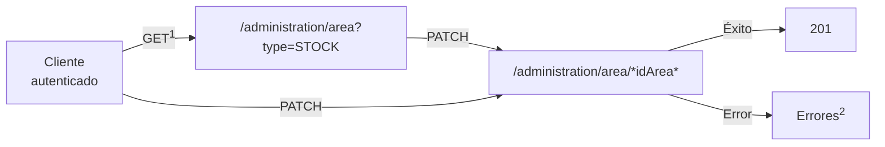
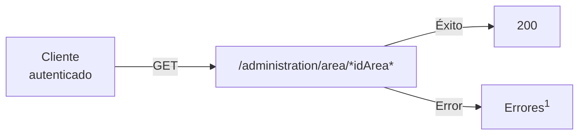
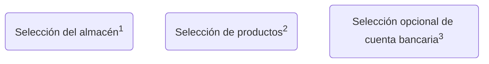
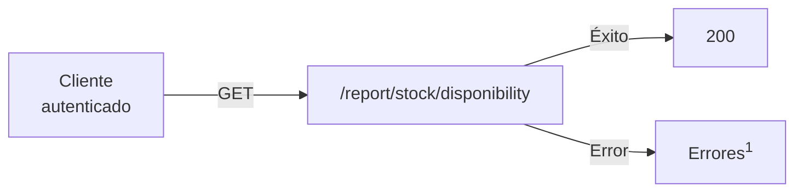
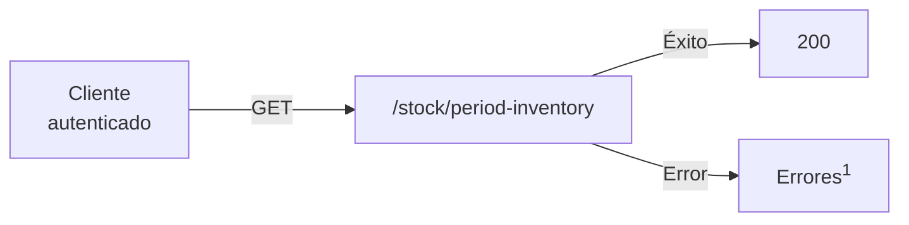

# Almacenes

Los almacenes de un negocio forman parte de las [áreas](../glosario.md#areas) que se gestionan en Tecopos.

Similar a cómo funciona un almacén físico con productos y personas encargadas de llevar un inventario, la API de Tecopos realiza los mismos flujos:

</br>

> <mark>Nota importante:</mark>
> 
> Para completar cada uno de estos flujos , el cliente de las API de Tecopos debe estar primeramente [autenticado](autenticación.md) a través de un [usuario](usuarios.md) que le permita realizar dicha operación

</br>

### Gestión de Almacenes

>Limitado a usuarios de rol [Administrador](../glosario.md#roles)

</br>

- Creación de un almacén
- Modificación de propiedades y usos de un almacén
- Información sobre un almacén

</br>

#### Creación de un almacén

Un almacén no es más que la creación de un área especificando que sea de tipo [almacén](../glosario.md#areas) y proveyendo un nombre para este como identificador de cara a los usuarios.

<div style="text-align: right"><sup>Endpoint POST <a href="#nuevo-almacen">/administration/area</a></sup></div>


</br>

<sup>1</sup>: consultar los posibles [errores](../errores.md) manejados por la API 

</br>
</br>

#### Modificación de propiedades y usos de un almacén

De manera general se pueden modificar los atributos que son generados por parte del usuario. Los que más interesan son el nombre, el estado, y además regular el uso de movimientos directos así como el hacer despachos a partir de órdenes de producción.

<div style="text-align: right"><sup>Endpoint PATCH <a href="#nuevo-almacen">/administration/area/*idArea*</a></sup></div>


</br>

<sup>1</sup>: en caso de que no tenga el identificador del almacén desde antelación </br>
<sup>2</sup>: consultar los posibles [errores](../errores.md) manejados por la API 

</br>
</br>

#### Información sobre un almacén

De un almacén además de su nombre y estado se pueden obtener demás tipos de informaciones como una descripción, un código de referencia, si constituye un almacén principal, y otras características comunes que poseen las áreas.

<div style="text-align: right"><sup>Endpoint GET <a href="#nuevo-almacen">/administration/area/*idArea*</a></sup></div>


</br>

<sup>1</sup>: consultar los posibles [errores](../errores.md) manejados por la API 

</br>
</br>
</br>

---

### Gestión de Productos

>Limitado a usuarios de rol [Control](../glosario.md#roles) o superior.

</br>

- Entrada de productos
- Traslado de un producto hacia otra área
- Baja de un producto
- Ajuste de la cantidad de un producto
- Conversión de un producto en otro

</br>

#### Entrada de productos

Después de haberse definidos productos en el sistema, se puede realizar su entrada o en otras palabras el registro de estos luego de realizada una compra.

Para realizar una entrada de productos debe seleccionarse el almacén destino y los productos adquiridos, según el precio y proveedor si son necesarios especificarse. Como parte del proceso puede añadirse una nota y la cuenta bancaria empleada para dicha operación.

</br>




</br>
<sup>1</sup>: endpoint de obtención de almacenes </br>
<sup>2</sup>: endpoint de obtención de productos </br>
<sup>3</sup>: endpoint de obtención de cuentas bancarias </br>
<sup>4</sup>: consultar los posibles [errores](../errores.md) manejados por la API 

</br>
</br>

#### Traslado de un producto hacia otra área

[Descripcion]

[Diagrama]

</br>
</br>

#### Baja de un producto

[Descripcion]

[Diagrama]

</br>
</br>

#### Ajuste de la cantidad de un producto

[Descripcion]

[Diagrama]

</br>
</br>

#### Conversión de un producto en otro

[Descripcion]

[Diagrama]

</br>
</br>
</br>

---

### Control del Inventario

>Limitado a usuarios de rol [Control](../glosario.md#roles) o superior.

</br>

- Obtención del balance
- Obtención de la disponibilidad por producto
- Obtención de reportes dentro de un periodo determinado

</br>
#### Obtención del balance

Para conocer la situación económica de un negocio, se puede consultar los balances de los almacenes. 

<div style="text-align: right"><sup>Endpoint GET <a href="#obtencion-balance">/report/stock/inventory</a></sup></div>


</br>

<sup>1</sup>: consultar los posibles [errores](../errores.md) manejados por la API 

</br>
</br>

#### Obtención de la disponibilidad por producto

El sistema Tecopos ayuda a conocer en tiempo real cual es la disponibilidad de los productos en cada almacén.

<div style="text-align: right"><sup>Endpoint GET <a href="#obtencion-disponibilidad">/report/stock/disponibility</a></sup></div>



</br>
</br>

#### Obtención de reportes dentro de un periodo determinado

Por cada almacén se puede obtener, un resumen de operaciones sobre cada producto dentro de un periodo de tiempo determinado. 

<div style="text-align: right"><sup>Endpoint GET <a href="#obtencion-reportes-rango">/stock/period-inventory</a></sup></div>



</br>
</br>
</br>

---

### Endpoints

#### Almacenes (Áreas)

[](https://god.gw.postman.com/run-collection/:collection_id)

| Descripción | Método HTTP | Dirección | Entrada de datos | Respuesta |
| ---- | ---- | ---- | ---- | ---- |
| Obtención de todos los almacenes | GET | /administration/area?type=[STOCK](../glosario.md#areas)<br> | Filtros comunes de [paginado](../paginado.md) | [Paginado](../paginado.md) de Objeto [*Area*](../objetos.md#area) de tipo almacén |
| Obtención de un almacén en específco | GET | /administration/area/\*idArea\* | [*idArea*](#parametros) | Objeto [*Area*](../objetos.md#area) de tipo almacén  |
| <bold id="nuevo-almacen">Creación de un nuevo almacén</bold> | POST | /administration/area | [*NewArea*](../objetos.md#nueva-area) | Objeto [*Area*](../objetos.md#area) de tipo almacén |
| Modificación de un almacén existente | PATCH | /administration/area/\*idArea\* | [*idArea*](#parametros) | Objeto [*Area*](../objetos.md#area) de tipo almacén |
| Eliminación de un almacén | DELETE | /administration/area/\*idArea\* | [*idArea*](#parametros) | - |

<bold id="parametros">Parámetros:</bold>

- idArea: identificador único de un almacén

</br>
</br>
#### Productos

[](https://god.gw.postman.com/run-collection/:collection_id)

| Descripción | Método HTTP | Dirección | Entrada de datos | Respuesta |
| ---- | ---- | ---- | ---- | ---- |
| Creación de un nuevo producto | POST | /administration/product | Objeto [*NewProduct*](#newProduct) |  |
| Obtención de productos | GET | /administration/product | - | [Paginado](../paginado.md) de Objeto [*Product*](#producto) |
| Obtención de productos por área | GET | /administration/product/area/{idArea} | [*idArea*](#parametros) |  |
| Entrada de productos | POST | /administration/movement/bulk/entry |   |  |


**Objetos:**

Objeto <bold id="newProduct">*NewProduct*</bold> </br> <sub>Propiedades:</sub>

- *name* [string]: </br> nombre del producto

---

- *price* [number]: </br> precio del producto

---

- *salesCategoryId* [number]: </br> identicador único de la categoría de ventas a la que pertenece el producto

---

- *type* [string]: </br> [tipo de producto](../glosario.md#tipos-productos)

Ejemplo:

```json
{
  "name": "Pantalón",
  "price": 350,
  "salesCategoryId": 15,
  "type": "VARIATION"
}
```

Objeto <bold id="producto">*Product*</bold> </br> <sub>Propiedades:</sub>

```json
{
  "id": 1,
  "name": "Producto prueba",
  "salesCode": "00001",
  "description": null,
  "promotionalText": null,
  "type": "STOCK",
  "showForSale": true,
  "stockLimit": true,
  "qrCode": null,
  "totalQuantity": 45,
  "measure": "UNIT",
  "suggested": false,
  "onSale": false,
  "alertLimit": null,
  "isPublicVisible": true,
  "averagePreparationTime": null,
  "elaborationSteps": null,
  "averageCost": 0,
  "isAlertable": true,
  "productCategoryId": null,
  "salesCategoryId": null,
  "groupName": null,
  "groupConvertion": 1,
  "isWholesale": null,
  "minimunWholesaleAmount": 1,
  "enableGroup": null,
  "productCategory": null,
  "salesCategory": null,
  "images": [],
  "prices": [
    {
      "price": 300,
      "codeCurrency": "CUP",
      "isMain": true,
      "priceSystemId": 1
    }
  ],
  "listManufacturations": []
  },
  "variations": []
}
```

</br>
</br>
#### Inventario

[](https://god.gw.postman.com/run-collection/:collection_id)

| Descripción | Método HTTP | Dirección | Entrada de datos | Respuesta |
| ---- | ---- | ---- | ---- | ---- |
| <bold id="#obtencion-balance">Obtención del balance</bold> | GET | /report/stock/inventory | - | Objeto [GeneralBalanceStock](#balance-general-almacenes) |
| <bold id="obtencion-disponibilidad">Obtención de la disponibilidad por producto</bold> | GET | /report/stock/disponibility | - | Objeto [GeneralStockReport](#reporte-general-almacenes) |
| <bold id="obtencion-reportes-rango">Obtención de reportes dentro de un periodo determinado</bold> | GET | /stock/period-inventory | Parámetros de consulta: </br> </br>[dateFrom](#fecha-desde) </br></br> [dateTo](#fecha-hasta) </br></br> [areaId]() | Arreglo de Objeto  |


**Parámetros**:

<bold id="fecha-desde">*dateFrom*</bold>: fecha de inicio del rango de fecha

<bold id="fecha-hasta">*dateTo*</bold>: fecha final del rango de fecha

<bold id="id-area">*areaId*</bold>: identificador único de un área 

</br>

**Objetos:**

Objeto <bold id="balance-general-almacenes">*GeneralBalanceStock*</bold> </br> <sub>Propiedades:</sub>

- mainCurrency [srtring]: </br> Moneda principal

---

- result [array]: </br> arreglo de objetos *BalanceStockReport*

</br>

Objeto *BalanceStockReport* </br> <sub>Propiedades:</sub>

- areaId [number]: </br> idenificador único de áreas

---

- areaName [string]: </br> nombre del área

---

- total_cost [number]: </br> costo total

---

- total_estimated_sales [number]: </br> total estimado de ventas

---

- total_estimated_profits [number]: </br> total estimado de ganancias


Ejemplo:

```json
{
  "mainCurrency": "CUP",
  "result": [
    {
      "areaId": 1,
      "areaName": "Almacén principal (Shop)",
      "total_cost": 0,
      "total_estimated_sales": 15000,
      "total_estimated_profits": 15000
    },
    {
      "areaId": 6,
      "areaName": "Area de Prueba - Almacén (Shop)",
      "total_cost": 0,
      "total_estimated_sales": 0,
      "total_estimated_profits": 0
    },
    {
      "areaId": 9,
      "areaName": "Almacen prueba (Shop)",
      "total_cost": 0,
      "total_estimated_sales": 0,
      "total_estimated_profits": 0
    }
  ]
}
```

</br>

Objeto <bold id="reporte-general-almacenes">*GeneralStockReport*</bold> </br> <sub>Propiedades:</sub>

- *mainCurrency* [string]: </br> moneda principal

---

- result [array]: </br> arreglo de objetos [*StockReport*](#reporte-almacen)

</br>

Objeto <bold id="reporte-almacen">*StockReport*</bold>: </br> <sub>Propiedades:</sub>

- productId [number]: </br> identificador del producto

---

- universalCode [number]: </br> código universal del producto

---

- productName [string]: </br> nombre del producto

---

- salesCategoryName [string]: </br> nombre de la categoría

---

- disponibility [number]: </br> disponibilidad del producto

---

- total_cost [number]: </br> costo total

---

- total_estimated_sales [number]: </br> total estimado de ventas

---

- total_estimated_profits [number]: </br> total estimado de ganancias

Ejemplo:

```json
{
  "mainCurrency": "CUP",
  "result": [
    {
      "productId": 4,
      "universalCode": 4,
      "productName": "Chorizo Don Carlos Gallardo y Ramirez",
      "salesCategoryName": "Sin categoría",
      "disponibility": 9,
      "total_cost": 0,
      "total_estimated_sales": 1800,
      "total_estimated_profits": 1800
    },
    {
      "productId": 1,
      "universalCode": 1,
      "productName": "Producto prueba",
      "salesCategoryName": "Sin categoría",
      "disponibility": 44,
      "total_cost": 0,
      "total_estimated_sales": 13200,
      "total_estimated_profits": 13200
    }
  ]
}
```

Ejemplo:

```json
[
    {
        "stockProductId": 1,
        "productId": 1,
        "name": "Producto prueba",
        "measure": "UNIT",
        "productCategory": "Sin categoría",
        "productCategoryId": null,
        "inStock": 44,
        "entry": 0,
        "initial": 0,
        "movements": 0,
        "outs": 0,
        "sales": -312,
        "onlineSales": 0,
        "processed": 0,
        "waste": 0,
        "variations": [],
        "enableGroup": null,
        "groupName": null,
        "groupConvertion": 1
    },
    {
        "stockProductId": 2,
        "productId": 4,
        "name": "Chorizo Don Carlos Gallardo y Ramirez",
        "measure": "UNIT",
        "productCategory": "Sin categoría",
        "productCategoryId": null,
        "inStock": 9,
        "entry": 10,
        "initial": 0,
        "movements": 0,
        "outs": 0,
        "sales": -37,
        "onlineSales": 0,
        "processed": 0,
        "waste": 0,
        "variations": [],
        "enableGroup": null,
        "groupName": null,
        "groupConvertion": 1
    },
    {
        "productId": 6,
        "name": "Carne de cerdo",
        "measure": "UNIT",
        "productCategory": "Sin categoría",
        "productCategoryId": null,
        "inStock": 0,
        "initial": 0,
        "entry": 50,
        "movements": 0,
        "outs": 0,
        "sales": -50,
        "onlineSales": 0,
        "processed": 0,
        "waste": 0,
        "variations": [],
        "enableGroup": null,
        "groupName": null,
        "groupConvertion": 1
    }
]
```
