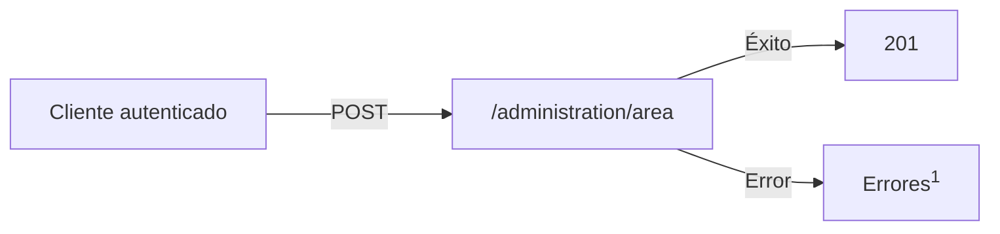
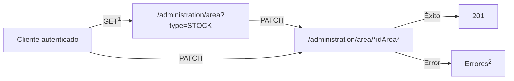
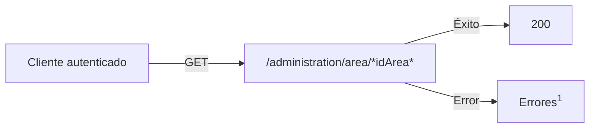

# Almacenes

Los almacenes de un negocio forman parte de las [áreas](../glosario.md#areas) que se gestionan en Tecopos.

Similar a cómo funciona un almacén físico con productos y personas encargadas de llevar un inventario, la API de Tecopos realiza los mismos flujos:

</br>

> <mark>Nota importante:</mark>
> 
> Para completar cada uno de estos flujos , el cliente de las API de Tecopos debe estar primeramente [autenticado](autenticación.md) a través de un [usuario](usuarios.md) que le permita realizar dicha operación

</br>

### Gestión de Almacenes

>Limitado a usuarios de rol [Administrador](../glosario.md#roles)

</br>

- Creación de un almacén
- Modificación de propiedades y usos de un almacén
- Información sobre un almacén

</br>

#### Creación de un almacén

Un almacén no es más que la creación de un área especificando que sea de tipo [almacén](../glosario.md#areas) y proveyendo un nombre para este como identificador de cara a los usuarios.


</br>

<sup>1</sup>: consultar los posibles [errores](../genericos/errores.md) manejados por la API 

</br>
</br>

#### Modificación de propiedades y usos de un almacén

De manera general se pueden modificar los atributos que son generados por parte del usuario. Los que más interesan son el nombre, el estado, y además regular el uso de movimientos directos así como el hacer despachos a partir de órdenes de producción.


</br>

<sup>1</sup>: en caso de que no tenga el identificador del almacén desde antelación </br>
<sup>2</sup>: consultar los posibles [errores](../genericos/errores.md) manejados por la API 

</br>
</br>

#### Información sobre un almacén

De un almacén además de su nombre y estado se pueden obtener demás tipos de informaciones como una descripción, un código de referencia, si constituye un almacén principal, y otras características comunes que poseen las áreas.


</br>

<sup>1</sup>: Consultar los posibles [errores](../genericos/errores.md) manejados por la API 

</br>
</br>
</br>

---

### Gestión de Productos

>Limitado a usuarios de rol [Control](../glosario.md#roles) o superior.

</br>

- Entrada de productos
- Traslado de un producto hacia otra área
- Baja de un producto
- Ajuste de la cantidad de un producto
- Conversión de un producto en otro

</br>

Para empezar estos flujos es requirimiento que haya productos creados en base de datos.

</br>

#### Entrada de productos

[Descripcion]

[Diagrama]

</br>
</br>

#### Traslado de un producto hacia otra área

[Descripcion]

[Diagrama]

</br>
</br>

#### Baja de un producto

[Descripcion]

[Diagrama]

</br>
</br>

#### Ajuste de la cantidad de un producto

[Descripcion]

[Diagrama]

</br>
</br>

#### Conversión de un producto en otro

[Descripcion]

[Diagrama]

</br>
</br>
</br>

---

### Control del Inventario

>Limitado a usuarios de rol [Control](../glosario.md#roles) o superior.

</br>

- Obtención del balance
- Obtención de la disponibilidad por producto
- Obtención de reportes de un almacen dentro de un periodo determinado

---

### Endpoints

#### Almacenes (Áreas)

| Descripción | Método HTTP | Dirección | Entrada de datos | Respuesta |
| ---- | ---- | ---- | ---- | ---- |
| Obtención de todos los almacenes | GET | /administration/area?type=[STOCK](../glosario.md#areas)<br> | Filtros comunes de [paginado](../genericos/paginado.md) | [Paginado](../genericos/paginado.md) de Objeto [*Area*](../genericos/objetos.md#area) de tipo almacén |
| Obtención de un almacén en específco | GET | /administration/area/{idArea} | [*idArea*](#parametros) |  |
| <bold id="nuevo-almacen">Creación de un nuevo almacén</bold> | POST | /administration/area | [*NewArea*](../genericos/objetos.md#nueva-area) | Objeto Area de tipo almacén |
| Modificación de un almacén existente | PATCH | /administration/area/{idArea} | [*idArea*](#parametros) | Objeto Area de tipo almacén |
| Eliminación de un almacén | DELETE | /administration/area/{idArea} | [*idArea*](#parametros) |  |

<bold id="parametros">Parámetros:</bold>

- idArea: identificador único de un almacén

</br>

#### Productos

| Descripción | Método HTTP | Dirección | Entrada de datos | Respuesta |
| ---- | ---- | ---- | ---- | ---- |
| Creación de un nuevo producto | POST | /product | Objeto [*NewProduct*](#newProduct) |  |
| Obtención de productos | GET | /product |  | [Paginado](../genericos/paginado.md) de Objeto [*Product*](#producto) |
| Obtención de productos por área | GET | /administration/product/area/{idArea} | [*idArea*](#parametros) |  |

Objetos:

Objeto <bold id="newProduct">*NewProduct*</bold> </br> <sub>Propiedades:</sub>

- *name* [string]: </br> nombre del producto

---

- *price* [number]: </br> precio del producto

---

- *salesCategoryId* [number]: </br> identicador único de la categoría de ventas a la que pertenece el producto

---

- *type* [string]: </br> [tipo de producto](../glosario.md#tipos-productos)

Ejemplo:

```json
{
  "name": "Pantalón",
  "price": 350,
  "salesCategoryId": 15,
  "type": "VARIATION"
}
```

Objeto <bold id="producto">*Product*</bold> </br> <sub>Propiedades:</sub>

```json
{
  "id": 1,
  "name": "Producto prueba",
  "salesCode": "00001",
  "description": null,
  "promotionalText": null,
  "type": "STOCK",
  "showForSale": true,
  "stockLimit": true,
  "qrCode": null,
  "totalQuantity": 45,
  "measure": "UNIT",
  "suggested": false,
  "onSale": false,
  "alertLimit": null,
  "isPublicVisible": true,
  "averagePreparationTime": null,
  "elaborationSteps": null,
  "averageCost": 0,
  "isAlertable": true,
  "productCategoryId": null,
  "salesCategoryId": null,
  "groupName": null,
  "groupConvertion": 1,
  "isWholesale": null,
  "minimunWholesaleAmount": 1,
  "enableGroup": null,
  "productCategory": null,
  "salesCategory": null,
  "images": [],
  "prices": [
    {
      "price": 300,
      "codeCurrency": "CUP",
      "isMain": true,
      "priceSystemId": 1
    }
  ],
  "listManufacturations": []
  },
  "variations": []
}
```