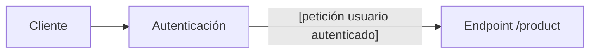

# Almacenes

Desde los procesos involucrados con los almacenes se gestionan los siguientes flujos:

> <mark>Nota importante:</mark>
> 
> Para completar cada uno de estos flujos , el cliente de las API de Tecopos debe estar primeramente [autenticado](autenticación.md) a través de un [usuario](usuarios.md) que le permita realizar dicha operación

### Gestión de Productos

1. Compra o entrada de productos
2. Traslado de un producto hacia otra área
3. Baja de un producto
4. Ajuste sobre la cantidad de un producto
5. Conversión de un producto en otro

 
#### 1. Compra o entrada de productos

Para realizar la compra de un producto, el cliente de las API de Tecopos debe estar primeramente autenticado a través de un usuario que le permita realizar dicha operación. 

**Endpoints involucrados**

| Método HTTP | Dirección | Entrada de datos | Ejemplos interactivos en Postman |
| ---- | ---- | ---- | ---- |
| POST | /product | {} |  |

 

#### 2. Traslado de un producto hacia otra área

Para realizar el traslado de un producto, el cliente de las API de Tecopos debe estar primeramente autenticado a través de un usuario que le permita realizar dicha operación. 

**Endpoints involucrados**

- dfdf

-----
### Gestión de Almacenes

- Creación de un almacén
- Designación de usuario responsable sobre un almacén

