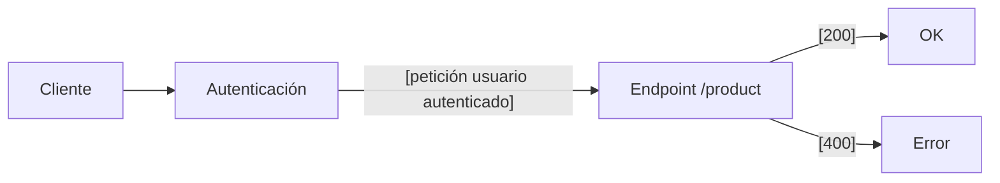

# Almacenes

El proceso de seguimiento de los almacenes abarcan los siguientes flujos:

> <mark>Nota importante:</mark>
> 
> Para completar cada uno de estos flujos , el cliente de las API de Tecopos debe estar primeramente [autenticado](autenticación.md) a través de un [usuario](usuarios.md) que le permita realizar dicha operación

### Gestión de Productos

1. Compra o entrada de productos
2. Traslado de un producto hacia otra área
3. Baja de un producto
4. Ajuste de la cantidad de un producto
5. Conversión de un producto en otro

</br>

#### 1. Compra o entrada de productos

Para realizar la compra de un producto, el cliente de las API de Tecopos debe estar primeramente autenticado a través de un usuario que le permita realizar dicha operación. 



Endpoints:

| Método HTTP | Dirección | Entrada de datos | Probar en Postman |
| ---- | ---- | ---- | ---- |
| POST | /product | Objeto [NewProduct](#newProduct) | [](https://god.gw.postman.com/run-collection/:collection_id) |

Objeto <bold id="newProduct">NewProduct</bold> </br> <sub>Propiedades:</sub>

- *name* [string]: </br> nombre del producto

---

- *price* [number]: </br> precio del producto

---

- *salesCategoryId* [number]: </br> identicador único de la categoría de ventas a la que pertenece el producto

---

- *type* [string]: </br> [tipo de producto](../glosario.md#tipos-productos)

Ejemplo:

```json
{
  "name": "Pantalón",
  "price": 350,
  "salesCategoryId": 15,
  "type": "VARIATION"
}
```

</br>
</br>
</br>

#### 2. Traslado de un producto hacia otra área

[Descripcion]

[Diagrama]

[Endpoint]

[Esquema]

</br>
</br>
</br>

#### 3. Baja de un producto

[Descripcion]

[Diagrama]

[Endpoint]

[Esquema]

</br>
</br>
</br>

#### 4. Ajuste de la cantidad de un producto

[Descripcion]

[Diagrama]

[Endpoint]

[Esquema]

</br>
</br>
</br>

#### 5. Conversión de un producto en otro

[Descripcion]

[Diagrama]

[Endpoint]

[Esquema]

---

### Gestión de Almacenes

- Creación de un almacén
- Designación de usuario responsable sobre un almacén